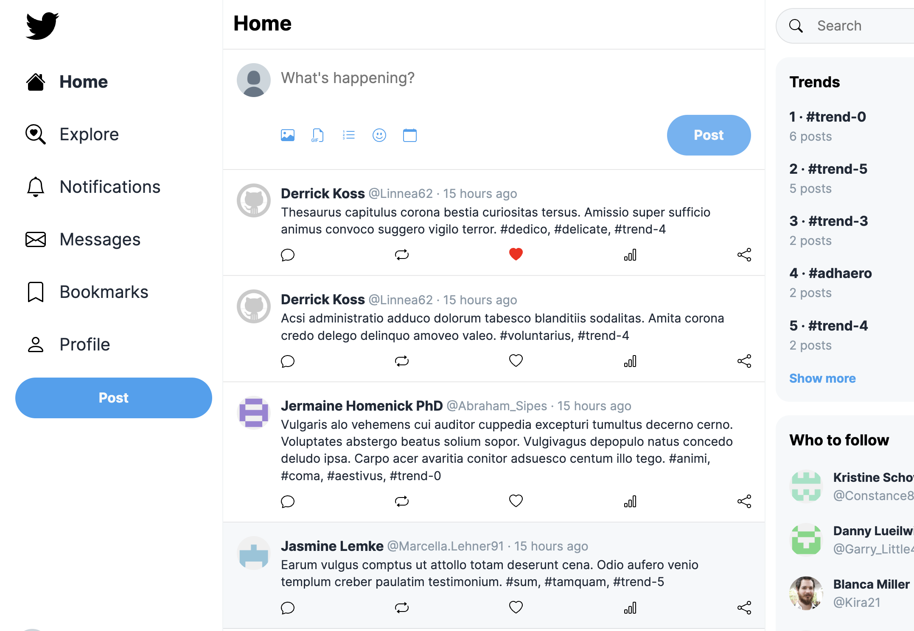

# Vue Twitter Clone - Frontend

> A Twitter clone built with Vue.js that allows users to create accounts, post tweets, follow other users, and interact with posts through likes and comments. This project aims to replicate the core functionalities of Twitter.



## Table of Contents

- [Vue Twitter Clone - Frontend](#vue-twitter-clone---frontend)
  - [Table of Contents](#table-of-contents)
    - [Prerequisites](#prerequisites)
    - [Installation](#installation)
  - [Usage](#usage)
  - [Built With](#built-with)
  - [Contributing](#contributing)
  - [Authors](#authors)
  - [License](#license)


### Prerequisites

What you need to install the software and how to install them.

- [Node.js](https://nodejs.org/) (developed with v21.4.0)
- [pnpm](https://pnpm.io/) (reccomended) or npm (comes with Node.js) or [Yarn](https://yarnpkg.com/)
- [Backend](https://github.com/fadamakis/vue-twitter-clone-backend)


### Installation

1. Clone the repository:

   ```bash
   git clone https://github.com/fadamakis/vue-twitter-clone-frontend.git
   ```

2. Navigate to the project directory:

   ```bash
   cd vue-twitter-clone-frontend
   ```

3. Install dependencies:

   ```bash
   pnpm install
   ```

4. Set up environment variables:

   - Copy the `.env.example` file to `.env`:

     ```bash
     cp .env.example .env
     ```

   - Fill in the required environment variables in the `.env` file.

## Usage

To run the project locally, use the following command:

```bash
pnpm dev
```

Visit `http://localhost:3000` in your browser to see the application.


## Built With

- [Vue.js](https://vuejs.org/) - The web framework used

## Contributing

Please read [CONTRIBUTING.md](CONTRIBUTING.md) for details on our code of conduct, and the process for submitting pull requests.


## Authors

- **Fotis Adamakis** - *Initial work* - [fadamakis](https://github.com/fadamakis)

See also the list of [contributors](https://github.com/fadamakis/vue-twitter-clone-frontend/contributors) who participated in this project.

## License

This project is licensed under the [MIT License](https://opensource.org/license/MIT).